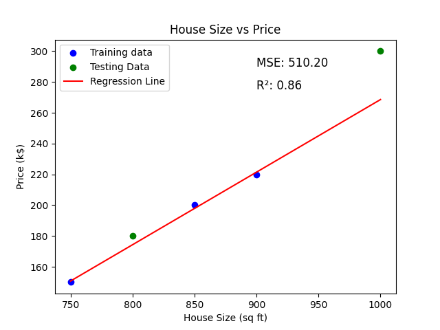

# Supervised Regression Example: House Price Prediction

This repository contains a detailed example of applying linear regression to a small dataset. The goal is to predict house prices based on the size of the house (in square feet).

## Table of Contents

- [1: Problem Definition](#step-1-problem-definition)
- [2: Data Collection](#step-2-data-collection)
- [3: Data Preprocessing](#step-3-data-preprocessing)
- [4: Splitting the Data](#step-4-splitting-the-data)
- [5: Choose a Model](#step-5-choose-a-model)
- [6: Train the Model](#step-6-train-the-model)
- [7: Evaluate the Model](#step-7-evaluate-the-model)
- [8: Calculating the Performance Metrics](#step-8-calculating-the-performance-metrics)
- [9: Plotting the Results](#step-9-plotting-the-results)
- [Conclusion](#conclusion)

## 1: Problem Definition

The objective of this project is to predict a continuous output (price of a house) based on input features (size of a house).

### Model Assumptions:

- The model assumes a linear relationship between the input feature (house size) and the output (house price).
- The linear equation used is:

\[
y = w \cdot x + b
\]

Where:
- \( y \) is the predicted price.
- \( x \) is the input feature (house size).
- \( w \) is the weight (slope).
- \( b \) is the bias (y-intercept).

## 2: Data Collection

The dataset used in this example consists of five data points with one feature:

| House Size (sq ft) | Price (k$) |
|--------------------|------------|
| 750                | 150        |
| 800                | 180        |
| 850                | 200        |
| 900                | 220        |
| 1000               | 300        |

### Example Calculation

If we assume an initial weight \( w = 0.5 \) and bias \( b = 50 \), the prediction for a house size \( x = 750 \) is:

\[
y = 0.5 \cdot 750 + 50 = 375 + 50 = 425 \text{ k$}
\]

## 3: Data Preprocessing

For this example, the data is already clean and ready to be used for training.

## Step 4: Splitting the Data

We split the dataset into training (80%) and testing (20%) sets using `train_test_split` from `sklearn`.

```python
import numpy as np
from sklearn.model_selection import train_test_split

# Dataset
X = np.array([[750], [800], [850], [900], [1000]])  # House sizes
y = np.array([150, 180, 200, 220, 300])  # Prices

# Split the dataset into training (70%) and testing (30%) sets
X_train, X_test, y_train, y_test = train_test_split(X, y, test_size=0.3, random_state=42)
```

## 5: Choose a Model

We'll use a simple linear regression model, which fits a straight line to the data.

## 6: Train the Model

We train the linear regression model on the training data.

```python
from sklearn.linear_model import LinearRegression

# Initialize the model
model = LinearRegression()

# Train the model
model.fit(X_train, y_train)
```

## 7: Evaluate the Model

After training, we evaluate the model's performance on the testing set.

```python
# Predict the prices for the test set
y_pred = model.predict(X_test)

# Print the predictions and the actual values
for i in range(len(y_test)):
    print(f"Actual Price: {y_test[i]}k, Predicted Price: {y_pred[i]:.2f}k")
```

### Output:
```python
Actual Price: 180k, Predicted Price: 174.29k
Actual Price: 300k, Predicted Price: 268.57k
```

## 8: Calculating the Performance Metrics

We calculate the Mean Squared Error (MSE) and R-squared (R²) to evaluate how well the model performs.

```python
from sklearn.metrics import mean_squared_error, r2_score

# Calculate MSE
mse = mean_squared_error(y_test, y_pred)
print(f"Mean Squared Error: {mse:.2f}")

# Calculate R-squared
r2 = r2_score(y_test, y_pred)
print(f"R-squared: {r2:.2f}")
```

### Output:
```python
Mean Squared Error: 510.20
R-squared: 0.86
```

## 9: Plotting the Results

To visualize the results, we plot the training data, testing data, and the regression line.

```python
import matplotlib.pyplot as plt

# Plot the training data
plt.scatter(X_train, y_train, color='blue', label='Training data')

# Plot the testing data
plt.scatter(X_test, y_test, color='green', label='Testing Data')

# Plot the regression line
plt.plot(X, model.predict(X), color='red', label='Regression Line')

# Labels and title
plt.title("House Size vs Price")
plt.xlabel("House Size (sq ft)")
plt.ylabel('Price (k$)')
plt.legend()

# Display the MSE and R-squared on the plot
plt.text(min(X) + 150, max(y) - 10, f'MSE: {mse:.2f}', fontsize=12, color='black')
plt.text(min(X) + 150, max(y) - 25, f'R²: {r2:.2f}', fontsize=12, color='black')

# Show the plot
plt.show()
```
Show Image Here 


## Conclusion

The regression model provides a prediction of house prices based on house size. Linear regression is suitable for datasets where the relationship between the input features and the target is linear. The weight 𝑤 tells us how much the price increases for each additional square foot of house size, while the bias 𝑏 gives us the predicted price when house size is zero.

### Key Points:

- Linear Regression is used for predicting a continuous target variable.
- Training data is used to fit the model.
- Testing data is used to evaluate how well the model performs on unseen data.
- Performance metrics such as MSE and R-squared help to understand how well the model fits the data.
- Visualization helps to see the fit of the regression line.
